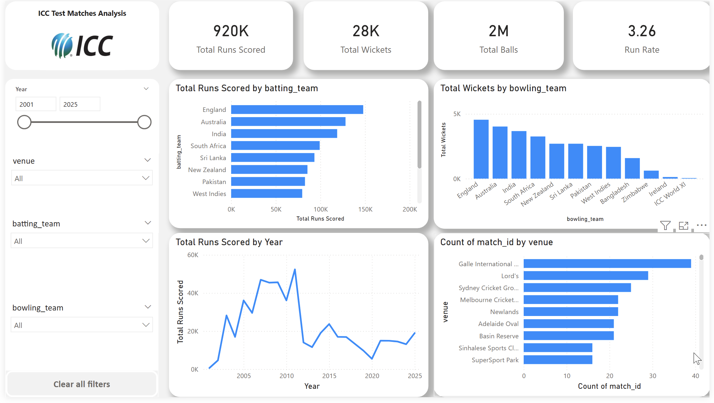
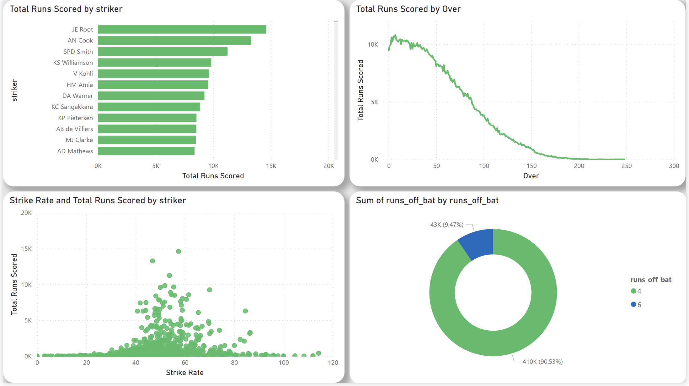
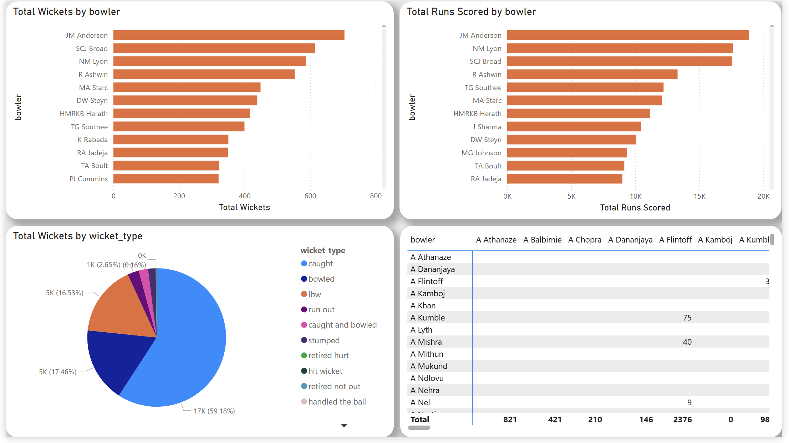

# 🏏 ICC Test Match Analytics Dashboard (Power BI)

An interactive multi-page Power BI dashboard built to analyze Test cricket match data after 2000.  
This project demonstrates end-to-end data analytics workflow including data cleaning, transformation, modeling, DAX calculations, and dashboard design.

---

# 🎯 Project Objective

The goal of this project is to create an analytical dashboard that provides insights into:

- Team performance analysis
- Batting and bowling performance comparison
- Match trends across years and venues
- Interactive filtering for dynamic insights

---

# 📊 Dashboard Pages

## 1️⃣ Overview Page

Executive summary view:

- Total Runs
- Total Wickets
- Total Balls
- Run Rate
- Runs by Team
- Wickets by Team
- Venue Analysis
- Year Trends

---

## 2️⃣ Batting Analysis

- Top run scorers
- Strike rate vs runs comparison
- Runs distribution by over
- Team batting comparison

---

## 3️⃣ Bowling Analysis

- Top wicket takers
- Bowling performance comparison
- Opposition analysis
- Tactical performance visuals

---

# 🧹 Data Cleaning & Transformation

The dataset contained ball-by-ball records and required preprocessing.

## Step 1 — Load Data

- Imported dataset using Power BI Desktop.
- Verified column data types.

---

## Step 2 — Data Cleaning

- Removed blank/null values.
- Corrected data types:
  - Date → Date format
  - Runs/Extras → Whole numbers
- Standardized column naming.

---

## Step 3 — Created Calculated Columns

New columns were added to enable analysis.

### Total Runs Column
Total Runs = runs + extras

Purpose:

- Combine runs scored with extras.

---

### Ball Count Column
Ball_Count = 1

Purpose:

- Used to calculate total balls.

---

### Is Wicket Column
Is_Wicket =
IF(player_dismissed <> BLANK(), 1, 0)

Purpose:

- Identify wicket events for aggregation.

---

### Over Number Column
Over = INT(ball)

Purpose:

- Extract over number from ball value.

---

# 🧩 Data Modeling

To allow flexible filtering:

## Teams Dimension Table

Created unified team table:
Teams =
DISTINCT(
UNION(
SELECTCOLUMNS(Test,“Team”,Test[batting_team]),
SELECTCOLUMNS(Test,“Team”,Test[bowling_team])
)
)
Purpose:

- Single slicer controlling both batting and bowling analysis.

Relationships created between:

- Teams[Team] → Test[batting_team]
- Teams[Team] → Test[bowling_team]

---

# 📐 DAX Measures Created

## Total Runs
Total Runs =
SUM(Test[Total Runs])

---

## Total Balls
Total Balls =
SUM(Test[Ball_Count])

---

## Total Wickets
Total Wickets =
SUM(Test[Is_Wicket])

---

## Run Rate
Run Rate =
DIVIDE([Total Runs], [Total Balls]) * 6
---

## Strike Rate
Strike Rate =
DIVIDE([Total Runs], [Total Balls]) * 100

---

## Batting Runs (Unified Team Filter)
Total Runs Batting =
CALCULATE(
SUM(Test[runs]),
TREATAS(VALUES(Teams[Team]), Test[batting_team])
)
---

## Bowling Wickets (Unified Team Filter)
Total Wickets Bowling =
CALCULATE(
SUM(Test[Is_Wicket]),
TREATAS(VALUES(Teams[Team]), Test[bowling_team])
)
---

# 🎛 Slicer Implementation

- Created unified team slicer using Teams table.
- Enabled multi-selection.
- Synced slicers across all dashboard pages.

Purpose:

- Selecting teams updates both batting and bowling analysis.

---

# 🎨 Dashboard Design Approach

- Multi-page analytical layout.
- Different theme style for each page:
  - Overview → Executive style
  - Batting → Aggressive visual theme
  - Bowling → Tactical strategic theme.
- Consistent spacing and alignment.
- Interactive filtering enabled.

---

# 📸 Dashboard Screenshots

## Overview Page

## Batting Analysis

## Bowling Analysis

---

# 🛠 Tools & Technologies

- Power BI Desktop
- DAX
- Data Modeling
- Data Visualization
- Git & GitHub

---

# 📂 Dataset

Dataset excluded due to GitHub size limits.  
Available upon request.

---

# 🚀 Future Improvements

- Player-level analytics
- Advanced performance metrics
- Predictive trend analysis

---

# 👨‍💻 Author

Swaroop  
MCA Student | Data Analytics Enthusiast

